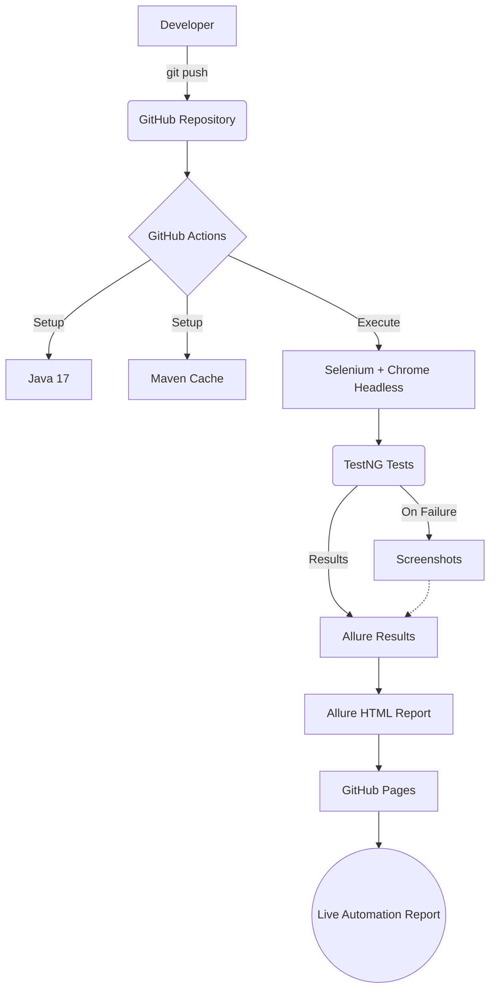

# End-to-End E-Commerce UI Automation Framework

This project is a production-quality UI automation framework built to validate the complete e-commerce shopping journey on [SauceDemo](https://www.saucedemo.com/). It serves as a portfolio project demonstrating industry-standard QA automation practices.

## 🚀 Project Overview

The framework automates the following End-to-End flow:
**User Login → Product Search/Selection → Add to Cart → Cart Verification → Checkout → Order Verification**

## 🛠 Tech Stack

- **Java 17**: Core programming language.
- **Selenium WebDriver (4.21+)**: Browser automation. (Uses built-in Selenium Manager for driver management).
- **TestNG**: Test execution, grouping, and assertions.
- **Maven**: Build automation and dependency management.
- **Jackson**: JSON parsing for data-driven testing.
- **Allure**: Comprehensive and interactive test reporting.
- **SLF4J / Logback**: Standardized logging.

## 🏗 Framework Architecture

The framework is organized using the **Page Object Model (POM)** to separate UI locators/actions from test logic, maximizing reusability and maintainability.

```
src/
├── main/java/com/qa/automation/
│   ├── factory/      # WebDriver initialization (DriverFactory)
│   ├── pages/        # Page Object classes (LoginPage, ProductsPage, etc.)
│   └── utils/        # Utilities (WaitUtility, JsonDataReader, ScreenshotUtility, ConfigManager)
│
├── test/java/com/qa/automation/
│   ├── base/         # Setup and Teardown logic (BaseTest)
│   └── tests/        # TestNG test cases
│
└── test/resources/
    ├── config/       # Environment configurations (config.properties)
    └── testdata/     # JSON test data (testdata.json)
```

## 🧩 Design Patterns & Principles
- **Page Object Model (POM)**: Ensures changes in the UI only require updates in one place (the Page class).
- **Data-Driven Testing**: Test data (credentials, products, customer info) is externalized in `testdata.json`. A custom `JsonDataReader` parses this into the tests, keeping code clean. TestNG `@DataProvider` is used for testing multiple login combinations.
- **Explicit Waits**: `WaitUtility` encapsulates `WebDriverWait` to handle dynamic elements intelligently, completely avoiding the anti-pattern of `Thread.sleep()`.

## 📊 Reporting

The framework integrates **Allure Reporting** along with a custom TestNG Listener (`TestListener.java`). 
- On test failure, a screenshot is automatically captured and attached to the Allure report.
- Standard annotations (`@Epic`, `@Feature`, `@Story`, `@Severity`) are used to categorize tests logically in the report.

## 🧪 Test Scenarios

| Test Case | Description | Group |
|-----------|-------------|-------|
| `testValidLogin` | Validates successful authentication and navigation to products page. | `smoke`, `regression` |
| `testInvalidLogin` | Validates error messages using multiple invalid credential combinations via DataProvider. | `regression` |
| `testEndToEndCheckout` | Validates the complete flow: Login > Add Product > Verify Cart > Enter Info > Summary > Complete. | `e2e`, `regression` |

## ⚙️ How to Run

### Prerequisites
- Java 17 or higher installed.
- Maven installed and added to PATH.
- Chrome browser installed (default).

### Local Execution (Visible Browser)
To run the entire suite defined in `testng.xml` with a visible browser window:
```bash
mvn clean test
```

### Headless Execution
To run the tests headlessly (without opening a visible browser window):
```bash
mvn clean test -Dheadless=true
```

### Generating Allure Report
After the test execution finishes, generate and serve the Allure report:
```bash
mvn allure:serve
```

*Note: Screenshots of failures are saved in `reports/screenshots/` and embedded directly into the Allure report.*

## 🚀 CI/CD with GitHub Actions

The project is fully integrated with **GitHub Actions** to enable Continuous Integration and Continuous Deployment (CI/CD) of test reports.

- Pushing to the `main` branch or creating a pull request automatically triggers the `automation-tests.yml` workflow.
- Tests execute automatically in **Chrome Headless** mode on an Ubuntu runner.
- Test artifacts (Surefire reports, Allure results, and screenshots) are preserved even if tests fail.
- The workflow automatically generates an **Allure HTML Report** and publishes it to **GitHub Pages**.

### CI/CD Architecture



## 📊 Latest Automation Report

[](https://github.com/<github-username>/<repository-name>/actions/workflows/automation-tests.yml)

**Live Allure Report:**
[https://<github-username>.github.io/<repository-name>/](https://<github-username>.github.io/<repository-name>/)

*(Note: Replace `<github-username>` and `<repository-name>` with your actual GitHub details. The URL becomes active after GitHub Pages is enabled in your repository settings and the first successful deployment occurs.)*

## 🔮 Future Enhancements
- **Cross-Browser Testing**: Expand `testng.xml` parameters to run tests across Chrome, Firefox, and Edge.
- **Parallel Execution**: Refine thread counts in `testng.xml` for faster execution of large suites.
- **Selenium Grid / Docker**: Execute tests in isolated Docker containers for a stable grid environment.
